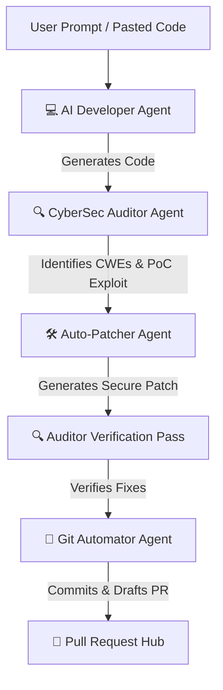

# 🛡️ PatchForge AI: Autonomous Multi-Agent SecOps Engine

PatchForge AI is an advanced, serverless multi-agent developer and cybersecurity pipeline built for the **Mega Agent-A-Thon**. It automates the lifecycle of secure code writing, vulnerability scanning, security patching, and repository staging. 

---

## 🎨 Premium Visual Theme
The interface is designed strictly in compliance with the **Stitch Ethereal Intelligence Framework (ChatFusion UI)**:
*   **Obsidian Dark Void Canvas**: Built over a deep, nocturnal base background (`#131313`) to prevent visual strain.
*   **Tonal Depth (The "No-Line" Rule)**: Avoids harsh 1px borders. Structural sections are divided by shifting background depths: Level 1 Stage (`#1c1b1b`) for panel wrappers, Level 2 Node (`#201f1f`) for cards, and Level 3 Focus (`#2a2a2a`) for active/hover states.
*   **Metallic Neon Accents**: Space-age `Space Grotesk` typography, a 135deg linear gradient from `#d0bcff` (Violet) to `#a078ff` for primary CTA actions, and neon `#4cd7f6` (Cyan) and `#ffb869` (Gold) highlights.
*   **Dynamic Diff Highlighting**: Features a dynamic side-by-side Diff Viewer that compares original vs patched code and highlights the exact modified lines in neon red/orange (removed) and green/cyan (added).

---

## 🧠 Core Architecture & Chained AI Agents
PatchForge runs a **true sequential multi-agent pipeline** powered by **Gemini 2.5 Flash** (via Google AI Studio). When you submit a run, the system chains 4 sequential agent steps, feeding each agent's outputs directly into the next:



### 1. 💻 AI Developer Agent
Ingests user requirements (e.g. *"Build a user profile search endpoint"*) and writes the functional script. Due to standard LLM training patterns, this code may contain typical security vulnerabilities or logical oversights.

### 2. 🔍 CyberSec Auditor Agent
Performs a static analysis scan on the generated or pasted code. It parses the AST to flag **security vulnerabilities (CWE / OWASP Top 10)** as well as **critical syntax errors and logical bugs** (like infinite loops or unclosed file connections).

### 3. 🛠️ Auto-Patcher Agent
Reads the auditor’s findings and refactors the code in-place. It implements secure programming patterns (like parameterized queries, strict input validation, resource managers, and safe directory sandboxing) while preserving the original functionality.

### 4. 🚀 Git Automator Agent
Stages the secure code changes, creates a local git branch, commits the fix, and automatically drafts a detailed GitHub Pull Request description in Markdown summarizing the security fixes.

---

## 🚀 Key Features & Unique Selling Points (USPs)

### 1. 🧪 Dual Workmodes (Prompt vs. Paste Code)
*   **Generate from Prompt**: The Developer Agent generates code from your high-level project descriptions, and the system secures it.
*   **Audit My Code**: Makes the Code Editor fully writable, allowing you to paste any script (Python, JS, Go, etc.) to scan and secure it instantly, skipping the developer agent phase.

### 2. 💥 USP 1: "Explain Like I'm the Attacker" (Exploit Simulator)
The Auditor Agent automatically generates a safe, detailed proof-of-concept (PoC) exploit payload (e.g. curl commands, python exploit scripts) demonstrating how an external hacker would abuse the unpatched vulnerability. 

### 3. 📋 USP 2: Enterprise Compliance Tagging
Automatically maps all identified vulnerabilities to corresponding industry compliance standards including **OWASP Top 10**, **SOC 2**, **GDPR**, and **PCI-DSS**, displaying compliance tags in the workspace and final PR.

### 4. 🧠 USP 3: Proactive "Security Memory" (Learning Loop)
*   **Prompt Alignment**: Auditor logs print proactive warnings reminding the Developer Agent of previously discovered flaws in similar file scopes, encouraging defensive coding habits.
*   **Interactive Sidebar**: Includes a toggleable **Security Memory** sidebar widget that displays active CWEs caught during the session, showing system insights and active context modifiers loaded. Also features manual triggers (`Teach Vulnerability` / `Reset Memory`) to test/demo memory states.

### 5. ⚙️ USP 4: "Shadow Executions" Syntax Validation
*   Enforces compilation and syntax checks before staging patches.
*   **Local CLI (`review_agent.py`)**: Runs local linter checks (e.g. `py_compile`, `node --check`, `go vet`). If a syntax/compile error occurs, it feeds the error back to Gemini and requests a corrected patch (up to 2 retries).
*   **Web App Console (`App.tsx`)**: Appends sandboxed compiler logs and automatically requests syntax self-corrections via the Gemini API if syntax issues are found.

---

## 📁 Repository Structure

*   `src/App.tsx`: Main dashboard and Live Gemini orchestrator.
*   `src/index.css`: Color tokens, gradients, animations, scrollbars, and Ethereal CSS classes.
*   `src/components/AgentActivity.tsx`: Agent terminal output console and reasoning timelines.
*   `src/components/DiffViewer.tsx`: Dynamic line-by-line code difference highlighting.
*   `src/components/PullRequestView.tsx`: Pull Request details page and merge action center.
*   `src/components/AttackReplay.tsx`: Reusable exploit replay and remediation summary card.
*   `agent_cli/review_agent.py`: Standalone CLI python script.

---

## 🛠️ Setup & Running Locally

### A. Web Application (React TS + Vite)
1.  Navigate to the repository root directory.
2.  Install dependencies:
    ```bash
    npm install
    ```
3.  Launch the local Vite development server:
    ```bash
    npm run dev
    ```
4.  Open the printed URL (usually `http://localhost:5173`) in your browser.
5.  *(Required)* Paste your Gemini API Key in the top-right header input.
6.  Enter a prompt or paste code, and click **Run AI Agents**!

### B. Standalone CLI Agent (Zero-Dependency Python Script)
1.  Navigate to the `agent_cli` directory:
    ```bash
    cd agent_cli
    ```
2.  Set your environment API key:
    *   **PowerShell**: `$env:GEMINI_API_KEY="your_api_key_here"`
    *   **Bash**: `export GEMINI_API_KEY="your_api_key_here"`
3.  Run the CLI scanner on any target file:
    ```bash
    python review_agent.py ..\test_codes\javascript_sql_injection.js
    ```
4.  To automatically write the secured patch to disk:
    ```bash
    python review_agent.py ..\test_codes\javascript_sql_injection.js --patch
    ```
5.  To automatically stage a git branch and commit the patch:
    ```bash
    python review_agent.py ..\test_codes\javascript_sql_injection.js --git
    ```
